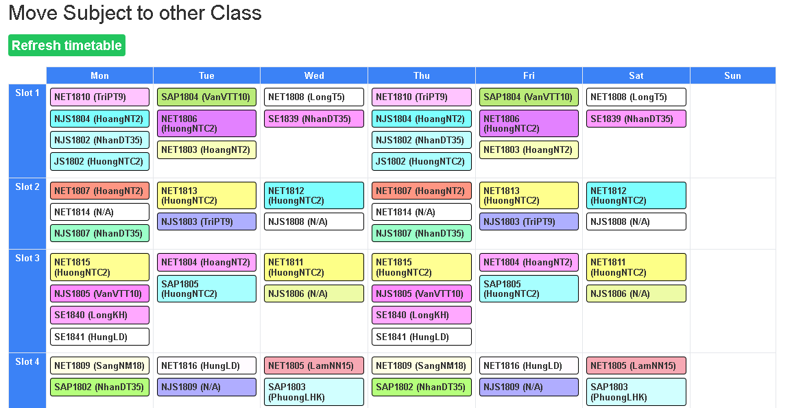

# classlist-getter

- A simple chrome extension for getting classlist and timetable for the students to move between classes before the semester start.
- Use this as a tool to visualize your next semester timetable, make plan and decide to move to the class that you are pointing to

## Demo

<!--  -->

## Installation

- Step 1: Download repository
- Step 2: Unzip the packed file
- Step 3: Go to chrome extension manager
- Step 4: Turn on "Developer mode"
- Step 5: Click "Load unpacked" button
- Step 6: Choose "dist" folder in the extracted folder

## Note

- Discourage to use in the rush hour
